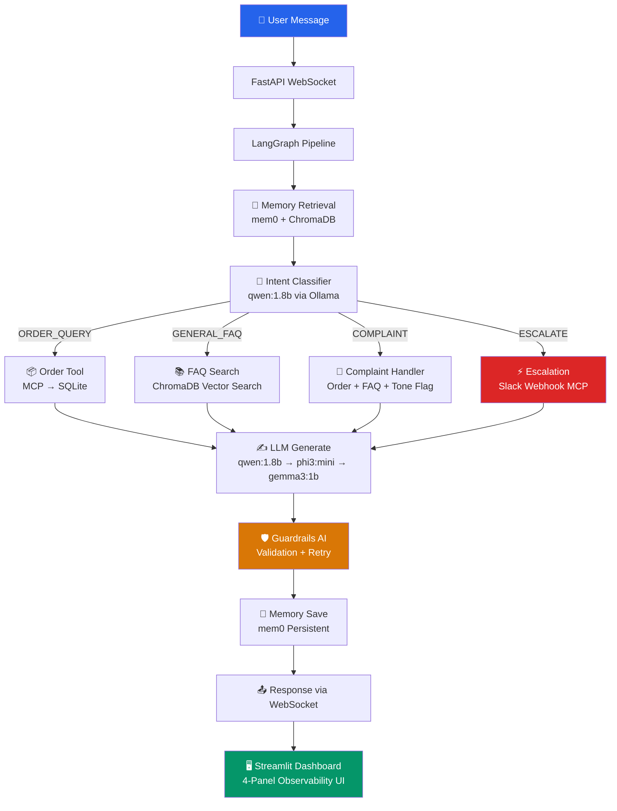

# 🤖 Autonomous Customer Support Agent

> Production-grade AI support agent with real-time observability, persistent memory, and human escalation. Built entirely locally — zero paid APIs.

[](https://python.org)
[](https://github.com/langchain-ai/langgraph)
[](https://ollama.ai)
[](https://fastapi.tiangolo.com)
[](https://streamlit.io)

---

## Architecture



## Model Stack

| Role | Model | Size | Purpose |
|------|-------|------|---------|
| Primary LLM | `qwen:1.8b` | 1.1GB | Main response generation |
| Fallback LLM | `phi3:mini` | 2.2GB | Complex reasoning fallback |
| Ultra-light | `gemma3:1b` | 815MB | Simple queries fallback |
| Embeddings | `mxbai-embed-large` | 669MB | ChromaDB + mem0 vector search |
| Embed fallback | `all-minilm:latest` | 45MB | Fast fallback embeddings |

**Fallback chain:** `qwen:1.8b → phi3:mini → gemma3:1b → graceful error`

---

## Quick Start

### 1. Clone and set up environment

```bash
git clone <your-repo>
cd support-agent
python -m venv venv
source venv/bin/activate
pip install -r requirements.txt
```

### 2. Configure environment

```bash

# Optionally add LANGSMITH_API_KEY and SLACK_WEBHOOK_URL
```

### 3. Pull Ollama models

```bash
# Install Ollama first: https://ollama.ai
ollama pull qwen:1.8b
ollama pull phi3:mini
ollama pull gemma3:1b
ollama pull mxbai-embed-large
ollama pull all-minilm:latest
```

### 4. Initialize databases

```bash
# Start Ollama in background
ollama serve &

# Initialize order database + ingest FAQs into ChromaDB
python knowledge_base/ingest.py
python -c "from tools.order_db import init_order_db; init_order_db()"
```

### 5. Run health check

```bash
python health_check.py
```

### 6. Start the agent

**Terminal 1 — FastAPI Backend:**
```bash
python -m uvicorn api.server:app --host 0.0.0.0 --port 8000
```

**Terminal 2 — Streamlit UI:**
```bash
streamlit run ui/app.py
```

Open **http://localhost:8501** in your browser.

### 7. Run automated demo

```bash
python demo.py
# Or with verbose event streaming:
python demo.py --verbose
```

---

## Project Structure

```
support-agent/
├── agent/
│   ├── graph.py          # LangGraph pipeline + SQLite checkpointer
│   ├── nodes.py          # All node functions with WebSocket events
│   ├── memory.py         # mem0 cross-session persistent memory
│   └── guardrails.py     # Output validation + retry logic
├── tools/
│   ├── mcp_server.py     # MCP stdio server (2 tools)
│   ├── order_db.py       # SQLite mock DB (20 sample orders)
│   └── slack_tool.py     # Slack webhook escalation
├── knowledge_base/
│   ├── ingest.py         # FAQ ingestion into ChromaDB
│   └── retriever.py      # Semantic vector search
├── api/
│   └── server.py         # FastAPI: WebSocket + /health + /metrics
├── ui/
│   └── app.py            # Streamlit 4-panel observability dashboard
├── data/
│   └── faqs.json         # 30 FAQ entries across 5 categories
├── demo.py               # Automated 3-scenario demo runner
├── health_check.py       # Service verification script
├── requirements.txt
├── .env.example
└── README.md
```

---

## Agent Flow

```
User Message
    │
    ▼
[1] memory_retrieval   ← mem0 fetches cross-session context
    │
    ▼
[2] intent_classifier  ← qwen:1.8b classifies + confidence score
    │
    ├─ ORDER_QUERY  ──► [3a] order_tool      ← MCP → SQLite
    ├─ GENERAL_FAQ  ──► [3b] faq_tool        ← ChromaDB vector search
    ├─ COMPLAINT    ──► [3c] complaint_tool  ← order + FAQ + tone_soften=True
    └─ ESCALATE     ──► [3d] escalate_tool   ← Slack webhook
                         (conf < 0.6 OR "human"/"agent" keywords)
    │
    ▼
[4] llm_generate       ← qwen:1.8b (fallback: phi3:mini → gemma3:1b)
    │
    ▼
[5] guardrails         ← validate: order IDs, tone, length (≤200 words)
    │                    retry up to 2x if fails
    ▼
[6] memory_save        ← mem0 saves turn for future sessions
    │
    ▼
Response via WebSocket → Streamlit UI
```

---

## API Reference

### WebSocket
```
ws://localhost:8000/ws/{user_id}
```

**Client → Server:**
```json
{"message": "What's the status of order ORD-100001?", "session_id": "abc123"}
```

**Server → Client (streaming events):**
```json
{"type": "node_active",   "node": "memory_retrieval", "elapsed_ms": 0}
{"type": "node_complete", "node": "intent_classifier", "elapsed_ms": 340,
 "metadata": {"intent": "ORDER_QUERY", "confidence": 0.87}}
{"type": "response", "text": "Your order ORD-100001...",
 "metadata": {"intent": "ORDER_QUERY", "confidence": 0.87, "model_used": "qwen:1.8b",
              "latency_ms": 1240, "guardrail_retries": 0, "escalated": false}}
```

### REST Endpoints

| Method | Path | Description |
|--------|------|-------------|
| GET | `/health` | Service health status |
| GET | `/metrics` | Aggregate performance metrics |
| GET | `/metrics/{session_id}` | Per-session metrics |
| GET | `/sessions/{user_id}` | List user sessions |
| GET | `/sessions/{user_id}/{session_id}/history` | Conversation history |
| GET | `/memory/{user_id}` | Get user memories |
| DELETE | `/memory/{user_id}` | Clear user memories |

---

## Sample Orders

The mock database includes 20 orders with these statuses:

| Order ID | Status | Product |
|----------|--------|---------|
| ORD-100001 | DELIVERED | Wireless Headphones |
| ORD-100002 | SHIPPED | Mechanical Keyboard |
| ORD-100003 | PROCESSING | USB-C Hub |
| ORD-100009 | REFUNDED | Noise Cancelling Earbuds |
| ORD-100016 | DELAYED | Streaming Deck |
| ORD-100005 | CANCELLED | Webcam 4K |
| ... | ... | ... |

---

## FAQ Categories

30 FAQ entries across 5 categories:
- **Orders** (5): tracking, cancellation, delays, bulk orders, free shipping
- **Returns** (5): policy, initiation, refund timing, exchanges, damaged items
- **Account** (5): password reset, payment methods, address, multiple accounts, deletion
- **Payments** (5): accepted methods, security, declined payments, installments, promo codes
- **Shipping** (5): options, international, lost packages, address changes, delays
- **Products** (5): sizing, authenticity, warranty, out of stock, manuals

---

## Guardrails

Every response is validated for:

1. **Order number format** — Only `ORD-XXXXXX` (6 digits) allowed; malformed IDs rejected
2. **Professional tone** — Scans for 20+ aggressive/dismissive phrases
3. **Response length** — Maximum `MAX_RESPONSE_WORDS` (default 200)
4. **Non-empty** — Response must have meaningful content

On failure: regenerate with correction instruction, up to `GUARDRAILS_MAX_RETRIES` (default 2).

---

## Configuration

All configuration via `.env` file:

```env
# Model selection
OLLAMA_PRIMARY_MODEL=qwen:1.8b
OLLAMA_FALLBACK_MODEL=phi3:mini

# Thresholds
ESCALATION_CONFIDENCE_THRESHOLD=0.6   # Escalate if confidence < this
GUARDRAILS_MAX_RETRIES=2              # Max guardrail retries
MAX_RESPONSE_WORDS=200                # Max response length

# Optional services
LANGSMITH_API_KEY=your_key_here       # Enable LangSmith tracing
SLACK_WEBHOOK_URL=https://hooks...    # Enable Slack escalation
```

---

## Observability Dashboard

The 4-panel Streamlit UI provides:

**Panel 1 — Live Workflow Visualizer**
- Animated pipeline nodes with pulsing CSS border during active processing
- Per-node elapsed time in milliseconds
- Escalation branch indicator (red Slack node)

**Panel 2 — Chat Window**
- Message metadata footer per response: `via qwen:1.8b · 1.2s · ORDER_QUERY · conf 0.87`
- Typing indicator while processing
- Export conversation as JSON
- Human escalation banner

**Panel 3 — Memory Context**
- All mem0 memories for current user with relative timestamps
- Memory count badge
- One-click memory clear

**Panel 4 — Agent Metrics**
- Session stats (messages, avg response time, escalations, retries)
- Intent distribution with progress bars
- System health indicators (auto-refresh 30s)
- LangSmith trace link

---

## LangSmith Tracing

1. Sign up free at [smith.langchain.com](https://smith.langchain.com)
2. Get API key → add to `.env` as `LANGSMITH_API_KEY`
3. Set `LANGSMITH_PROJECT=support-agent-portfolio`
4. All runs auto-traced with full span data

---

## Performance (M2 MacBook Air, 8GB RAM)

| Metric | Typical |
|--------|---------|
| Intent classification | 300–600ms |
| Order DB lookup | < 50ms |
| ChromaDB vector search | 100–300ms |
| LLM generation (qwen:1.8b) | 800–2000ms |
| Total end-to-end | 1.5–3.5s |
| Memory usage | ~2.5GB |

---

## Troubleshooting

**Ollama not responding:**
```bash
ollama serve  # Start in a terminal
curl http://localhost:11434/api/tags  # Verify
```

**ChromaDB empty:**
```bash
python knowledge_base/ingest.py --force
```

**mem0 initialization slow:**
> Normal — first-run embedding model warmup takes 30–60s.

**WebSocket timeout:**
> Increase timeout or check if `qwen:1.8b` is loaded: `ollama list`

**Port 8000 in use:**
```bash
FASTAPI_PORT=8001 uvicorn api.server:app --port 8001
```

---

## License

MIT License — built as a portfolio project demonstrating production-grade AI agent architecture.
